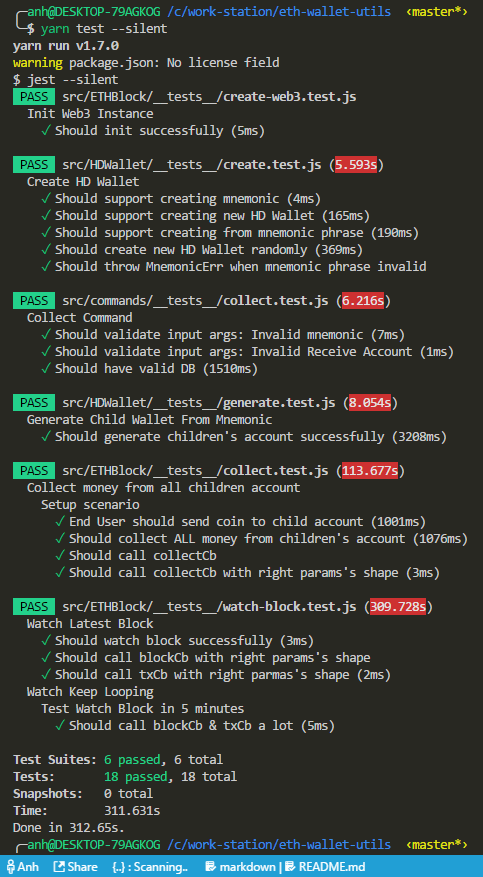
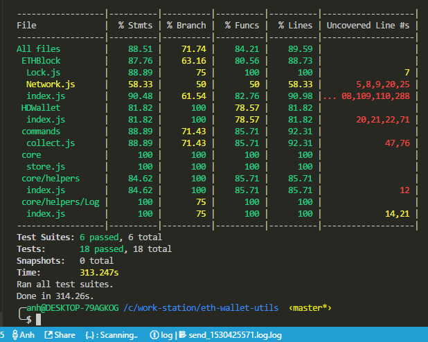

# ETH Utils

Case study:

+ eCommerce site needs wallet for each customer
+ However, manage all these wallets is overwhelm.

Solution: Simple hold `mnemonic` phrase, we can:

+ From __mnemonic__ phrase > Create __HD Wallet__
+ From __HD Wallet__ > Generate thousands __wallets__
+ From __HD Wallet__ > Collect back all coins from generated __wallets__

## Usage

+ Update `.ethrc` with your own info.
+ Run `source .ethrc` to inject environment variable before using libs.
+ Run `yarn call [file path]` to execute node with babel.

### Generate Wallets

```js
import HDWallet from 'HDWallet'
const mnemonic = HDWallet.newMnemonic();
const childrenInfo = HDWallet.generate()
```

+ [Example](examples/generate-wallets.js)

### Collect Coin

To manual test `yarn collect <mnemonic>` commands:

```bash
# Setup Scenario
yarn call src/commands/__tests__/manual/sendCoinAsEndUser.js

# Collect using test-case's mnemonic
yarn collect "roast recipe soon hat couch mercy inspire dynamic pottery smooth bubble arrest"
```

+ [Test Cases Info](src/commands/__tests__/manual/test-cases.js)
+ Log file: When finished, log file saved in `logs` folder as `collect-coin_[timestamp].log`

## Test

### Run Test

+ Test all cases

```bash
yarn test
```

+ Test all cases without `console.log`

```bash
yarn test --silent
```

+ Test single case

```bash
yarn test [file path]
```

+ Test with options

```bash
# Common used options
yarn test --silent --dectectOpenHandles --watch [file path]
```

+ Test coverage

```bash
yarn test --coverage
```

### Ignore Long-running Test Suites

Update code as `describe.skip` on these test suites

Long-running test suites:

+ [Watch Block](src/ETHBlock/__tests__/watch-block.test.js)

## Screenshots

### Collect Coin Log


### Test Console



### Test Coverage

